# Architecture blueprint

A visual map of the extension: what runs where, how a Meeting becomes a Summary Artifact, and which function does each step. Read top to bottom for the whole story, or jump to a section.

Domain words (Capture Span, Speaker Track, Held Recording…) are defined in [CONTEXT.md](../CONTEXT.md). The reasons behind the shape are in [docs/adr/](adr/).

> **Keep this current.** Any change to a message type, a `src/` module, a session state, or the Meeting End flow updates this file in the same commit. `tests/architecture-doc.test.ts` fails when a `src/` file or a message type is missing from it. See [Keeping this blueprint current](#keeping-this-blueprint-current).

**Contents**

1. [What it does, in one picture](#1-what-it-does-in-one-picture)
2. [The runtime pieces](#2-the-runtime-pieces)
3. [Module map](#3-module-map)
4. [A meeting, start to finish](#4-a-meeting-start-to-finish)
5. [Meeting session states](#5-meeting-session-states)
6. [Meeting End: `finishMeeting`](#6-meeting-end-finishmeeting)
7. [Recording audio](#7-recording-audio)
8. [Transcription and fusion](#8-transcription-and-fusion)
9. [Summarization pipeline](#9-summarization-pipeline)
10. [Failure, hold and retry](#10-failure-hold-and-retry)
11. [Where data lives](#11-where-data-lives)
12. [Message protocol](#12-message-protocol)
13. [Function index](#13-function-index)
14. [Keeping this blueprint current](#keeping-this-blueprint-current)

---

## 1. What it does, in one picture

The extension records a Teams or Zoom web meeting's audio, transcribes it, combines it with live captions, asks an LLM for a summary, and saves one HTML file. Teams captions can supply speaker names. Zoom captions use `Unknown` because the subtitle DOM does not supply a reliable speaker name.

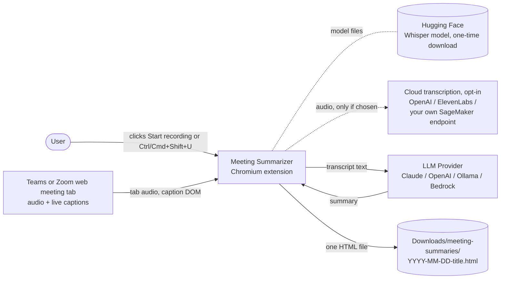

By default transcription runs locally (WASM Whisper), so the only thing that leaves the machine is the LLM call, and with Ollama not even that.

---

## 2. The runtime pieces

A Manifest V3 extension runs as several isolated contexts that only talk by message. Each box is one esbuild entry point (see `build.mjs`).

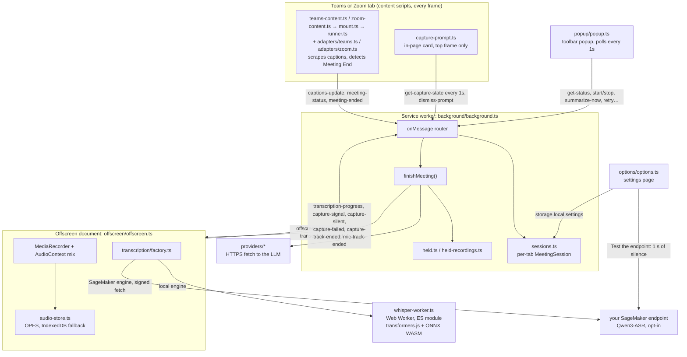

Why the split:

| Context | Why it exists |
|---|---|
| Content script | Only code in the page can read the caption DOM. All platform knowledge sits behind `PlatformAdapter` (ADR-0002). |
| Service worker | Owns state and decisions. Can be suspended at any time, so sessions are mirrored to `storage.session`. |
| Offscreen document | A service worker has no `MediaRecorder`, `AudioContext` or `getUserMedia`. The offscreen page does the recording and runs transcription. |
| Whisper worker | Keeps the WASM model off the offscreen page's main thread. The only ES-module bundle, because the ONNX runtime uses a dynamic import (ADR-0006). |
| Popup / Options | User surfaces. The popup is the explicit invocation Chromium requires before `tabCapture` will work. The Options page also calls the SageMaker endpoint itself, with one second of silence, to test the setup before a meeting depends on it. |

---

## 3. Module map

Every source file, grouped by folder. Arrows mean "imports / calls into".

```mermaid
flowchart LR
    subgraph content["src/content"]
        teamsContent["teams-content.ts"]
        zoomContent["zoom-content.ts"]
        mount["mount.ts<br/>one runner per platform and frame"]
        runner["runner.ts<br/>shared content loop"]
        capturePrompt["capture-prompt.ts"]
    end
    subgraph adapters["src/adapters"]
        adapter["adapter.ts<br/>PlatformAdapter interface"]
        teams["teams.ts"]
        zoom["zoom.ts"]
        accumulator["accumulator.ts<br/>TranscriptAccumulator"]
    end
    subgraph background["src/background"]
        bg["background.ts"]
        sessions["sessions.ts"]
        captureState["capture-state.ts"]
        captureSignal["capture-signal.ts"]
        captureSpans["capture-spans.ts"]
        micCapture["mic-capture.ts"]
        micAccess["microphone-access.ts"]
        badge["badge.ts"]
        meetingUrl["meeting-url.ts"]
        restoreContent["restore-content.ts"]
        heldT["held.ts"]
        heldR["held-recordings.ts"]
        writer["artifact-writer.ts"]
    end
    subgraph offscreen["src/offscreen"]
        offscreenTs["offscreen.ts"]
        audioMix["audio-mix.ts"]
        captureHealth["capture-health.ts"]
        micPermission["microphone-permission.ts"]
        audioStore["audio-store.ts"]
        signal["signal.ts"]
    end
    subgraph transcription["src/transcription"]
        txFactory["factory.ts"]
        txProvider["provider.ts"]
        localWhisper["local-whisper.ts"]
        whisperAudio["whisper-audio.ts"]
        whisperProtocol["whisper-protocol.ts"]
        whisperWorker["whisper-worker.ts"]
        txOpenai["openai.ts"]
        sagemaker["sagemaker.ts<br/>SDK signer + fetch"]
        elevenlabs["elevenlabs.ts"]
        engines["engines.ts<br/>engine names"]
        pcm["pcm.ts"]
        pauses["pauses.ts"]
        awsCreds["aws-credentials.ts"]
        silence["silence.ts"]
        fusion["fusion.ts"]
    end
    subgraph pipeline["src/pipeline"]
        pipe["pipeline.ts"]
        chunking["chunking.ts"]
        serialize["serialize.ts"]
        templates["templates.ts"]
        artifact["artifact.ts"]
        filename["filename.ts"]
    end
    subgraph providers["src/providers"]
        pFactory["factory.ts"]
        pIface["provider.ts"]
        anthropic["anthropic.ts"]
        openai["openai.ts"]
        ollama["ollama.ts"]
        bedrock["bedrock.ts"]
    end
    subgraph shared["src (shared)"]
        messages["messages.ts"]
        types["domain/types.ts"]
        settings["settings.ts"]
        platform["platform.ts"]
        manifestJson["manifest.json"]
    end
    subgraph ui["src/popup + src/options"]
        popupTs["popup/popup.ts"]
        optionsTs["options/options.ts"]
        optionsMicAccess["options/microphone-access.ts"]
    end

    teamsContent --> teams
    zoomContent --> zoom
    teamsContent & zoomContent --> mount --> runner
    runner --> adapter
    teams & zoom --> adapter
    bg --> sessions --> accumulator
    bg --> captureState & captureSignal & captureSpans & micCapture & micAccess & badge & meetingUrl
    meetingUrl --> manifestJson
    bg --> restoreContent --> meetingUrl
    bg --> heldT & heldR & writer
    bg --> fusion
    bg --> pipe
    bg --> pFactory
    offscreenTs --> audioMix & captureHealth & audioStore & signal & micPermission
    offscreenTs --> txFactory
    txFactory --> localWhisper & txOpenai & elevenlabs & sagemaker
    txOpenai & elevenlabs & sagemaker --> pcm
    txFactory & sagemaker --> awsCreds
    txFactory --> txProvider --> silence
    txProvider --> pauses
    localWhisper --> whisperProtocol
    whisperWorker --> whisperProtocol
    localWhisper --> whisperAudio
    whisperWorker --> whisperAudio --> whisperProtocol
    fusion --> silence
    pipe --> chunking & serialize & templates & artifact
    bg --> filename
    pFactory --> anthropic & openai & ollama & bedrock --> pIface
    popupTs --> settings
    optionsTs --> settings --> templates
    settings --> awsCreds
    bg & micCapture & popupTs & optionsTs --> engines
    optionsTs --> awsCreds & sagemaker
    popupTs --> awsCreds
    optionsTs --> micPermission
    optionsTs --> optionsMicAccess --> micPermission
```

`platform.ts` (the `chrome` namespace as `ext`), `messages.ts` (the protocol) and `domain/types.ts` (the vocabulary) are imported almost everywhere and are left off the arrows.

**Pure vs browser-bound.** Most logic is pure and unit-tested: `capture-state`, `capture-signal`, `capture-spans`, `capture-health`, `mic-capture`, `badge`, `meeting-url`, `fusion`, `silence`, `whisper-audio`, `provider` (transcription), `pauses`, `aws-credentials`, `sagemaker` (its fetch is injected), `pipeline/*`, `providers/*`, `audio-mix`, `signal`. The browser-bound shells (`background.ts`, `offscreen.ts`, `microphone-access.ts`, `microphone-permission.ts`, `audio-store.ts`, `whisper-worker.ts`, popup, options) are kept thin and checked by hand via [manual-checks.md](manual-checks.md). Tests cover the microphone permission check and Settings navigation with browser API substitutes. `content/runner.ts` is browser-bound too (DOM, `MutationObserver`, `ext`), but `tests/content-runner.test.ts` drives it under jsdom with a fake adapter.

---

## 4. A meeting, start to finish

The happy path: captions on, recording started, meeting ends, summary saved.

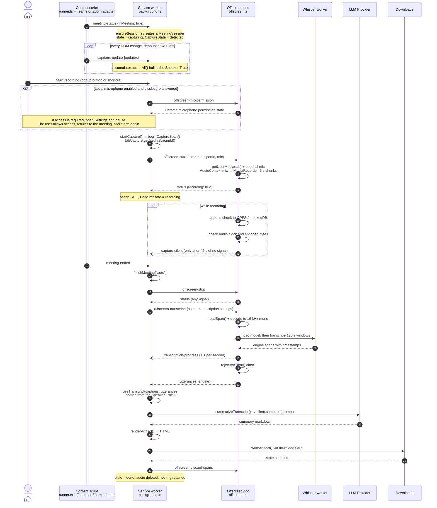

The same `finishMeeting()` is reached from five triggers: `auto` (adapter saw the call end), `manual` (popup *Summarize now*), `tab-closed`, `navigated` (tab left the meeting URL), `capture-lost` (recorder track died, or the worker woke to find the recorder gone).

---

## 5. Meeting session states

`MeetingSession.state` (`sessions.ts`) is the lifecycle. The surfaces show a finer `CaptureState`, derived by `deriveCaptureState()` (`capture-state.ts`), which splits `capturing` into *idle / detected / recording*.

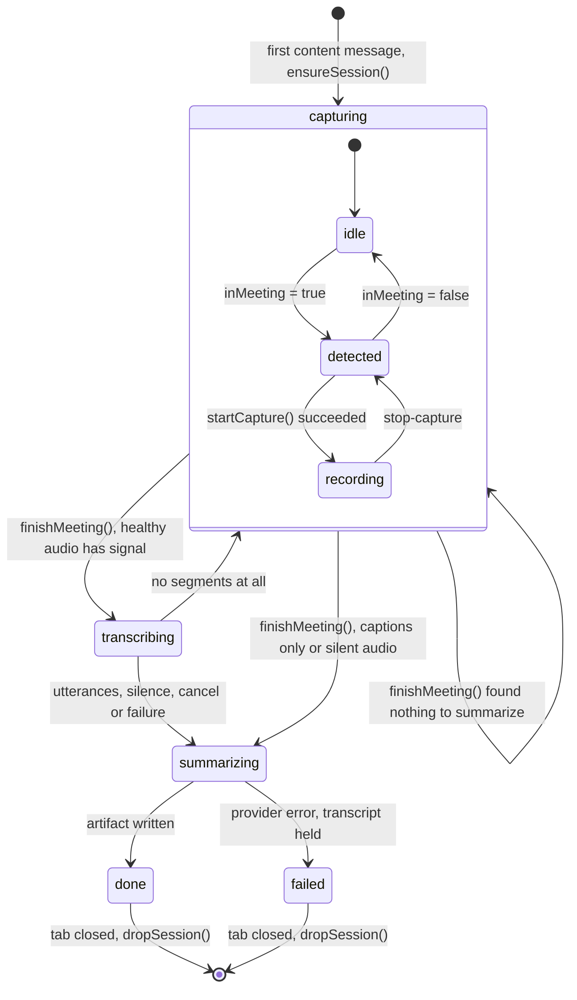

Microphone state is its own axis (`micCaptureState()` in `mic-capture.ts`): `off → unconfirmed → armed → recording`, or `unavailable` if Chromium refused it. The mic is recorded only when the setting is on **and** the disclosure was answered (ADR-0007). Consent is withdrawn whenever the cloud destination changes, including from one cloud engine to another (ADR-0008). Chrome must also grant microphone access. When that access is required, capture pauses and Settings opens. The visible Settings page requests access, closes the temporary stream, and tells the user to return to the meeting and start recording. A connected microphone track does not prove that speech reached the file. A capture failure clears the microphone recording flag and shows a warning.

---

## 6. Meeting End: `finishMeeting`

The central decision in `background.ts`. It decides where the Transcript's words come from, and whether anything has to be held for retry.

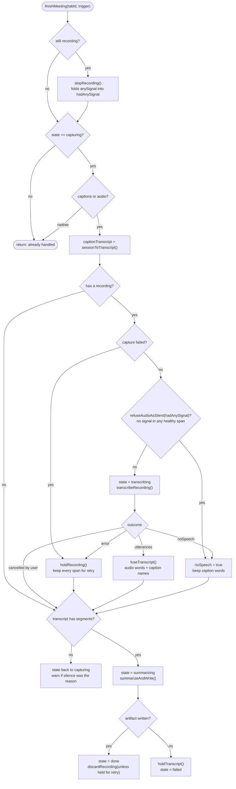

Three outcomes of transcription are kept apart on purpose: **words** (fuse them), **silence** (not an error, nothing to retry), **failure** (hold the audio, fall back to captions now). Silence requires a healthy capture. If the audio clock or encoder stops, the recording is held and `noSpeech` stays false. A later retry that returns no speech cannot clear that capture failure.

What the artifact says about its source (`Transcript.provenance`):

| Provenance | Words from | Speaker names from |
|---|---|---|
| `fused` | audio | caption Speaker Track; where none overlaps, the engine's diarization label, else *Unknown speaker* |
| `audio-unattributed` | audio | no caption match: the engine's diarization label (Scribe only), else *Unknown speaker* |
| `captions-only` | Teams or Zoom captions (Degraded Capture) | captions |

---

## 7. Recording audio

One Capture Span per Capture Start, each its own file (ADR-0005). Tab and microphone are summed into one stream on one clock (ADR-0007).

Before capture starts with the local microphone enabled, `microphone-access.ts` asks the offscreen document to check Chrome's permission state. A `prompt` or `denied` state opens Settings and pauses capture. The user can request access from that visible page. A granted state permits capture to start. If an OS or device error then prevents the microphone stream from opening, tab audio continues with a warning.

The graph keeps references to its streams, source nodes, and monitor nodes until capture stops. `capture-health.ts` checks that the audio clock advances and that the recorder produces bytes. A clock that does not advance for 10 seconds, or an encoder that does not produce new bytes for 20 seconds, causes `capture-failed`. RMS samples count as signal only while the clock advances. The stop operation has a 10-second limit and keeps incomplete audio for recovery. Events carry the owning tab and span so an old recorder cannot change the current session.

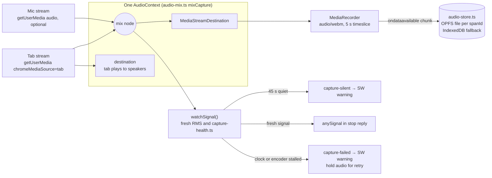

Span bookkeeping (`capture-spans.ts`): `beginSpan()` names a span `recordingId` + offset from the Meeting start, `orderedSpans()` keeps them in Capture Start order, `spanIdsOf()` lists files to delete. The gap between two spans is audio the user chose not to record, and nothing fills it.

Tracks that end on their own are reported, not ignored:
- tab track ended → `capture-track-ended` → `finishMeeting("capture-lost")`
- mic track ended → `mic-track-ended` → recording continues tab-only, `localMicrophone = false`, warning shown
- audio clock, encoder, or storage failed → `capture-failed` → capture stops, audio is held, and the artifact shows that its transcript can be incomplete

---

## 8. Transcription and fusion

Runs in the offscreen document. The engine is picked from settings at transcribe time (`transcription/factory.ts`), so switching engine can rescue a Held Recording.

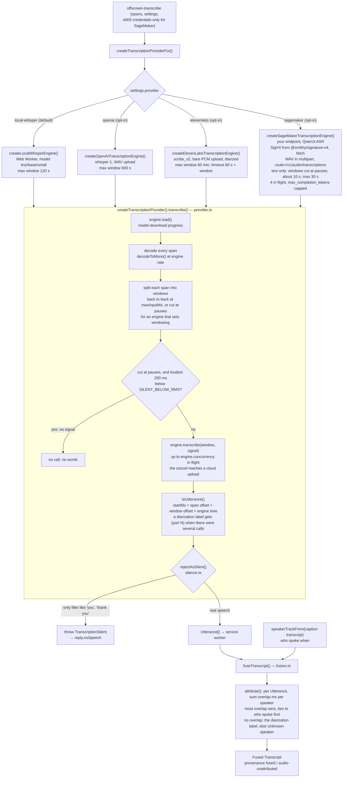

The Whisper worker (`whisper-worker.ts`) loads `transformers.js` `automatic-speech-recognition` with `dtype q8`, `device wasm`, graph optimization off. It talks to `local-whisper.ts` using the message types in `whisper-protocol.ts` (`load`, `transcribe` ↔ `model-progress`, `loaded`, `spans`, `failed`).

The cloud engines encode with `pcm.ts`: OpenAI and SageMaker wrap the 16-bit PCM in a WAV, and Scribe uploads it bare. All three pass the user's cancel signal to their request. Scribe also gives up after 60 s plus the window's length, with a `TranscriptionError`, so the Recording is held. Scribe is the only engine that diarizes. Its labels hold only inside one call, so the wrapper adds the part number when a recording takes several calls (ADR-0008). `engines.ts` gives each engine the name that the consent disclosure, the popup and the Summary Artifact show, and says which engines upload audio.

The SageMaker engine calls the user's own endpoint with `fetch`, and signs each call with the AWS SDK's own SigV4 signer, `@smithy/signature-v4`, hashing on Web Crypto (ADR-0009). It signs with temporary AWS credentials that the service worker reads from `storage.session` and sends in `offscreen-transcribe`, only when SageMaker is the selected engine. The header `route=/v1/audio/transcriptions` sends the call to vLLM's transcription route, and `to_language` forces the Meeting Language; for the three Meeting Languages that Qwen3-ASR does not list (`he`, `no`, `uk`) no language is sent. Qwen3-ASR returns text only, so the engine sets `windowing` and the wrapper cuts its windows at pauses: each window becomes one Utterance, and fusion names it from the captions. Every failure is a `SageMakerFailure` with a kind (credentials, endpoint, container, format or other), and expired credentials are refused before any upload. Each call gives up after 90 s; there is no automatic retry. Each call caps the reply at `max_completion_tokens` (16 per second of audio + 32), and four windows are in flight at once (`concurrency`). Windows with no signal are skipped by the wrapper: Qwen3-ASR invents words for silence.

`whisper-audio.ts` skips audio below an RMS floor of `0.00003`. It checks 20 ms frames, adds 0.5 seconds of context on each side, and merges overlapping ranges. The worker transcribes each retained range separately and restores its position in the recording. The local engine reports the retained duration through `inferenceDurationMs`, so the final speech check accepts a short sentence in a long, mostly quiet recording. Engines that omit this method use the decoded duration. Progress counts the full recording in both cases.

---

## 9. Summarization pipeline

`summarizeTranscript()` in `pipeline/pipeline.ts`. Pure: Transcript + settings + a `ProviderClient` in, HTML out.

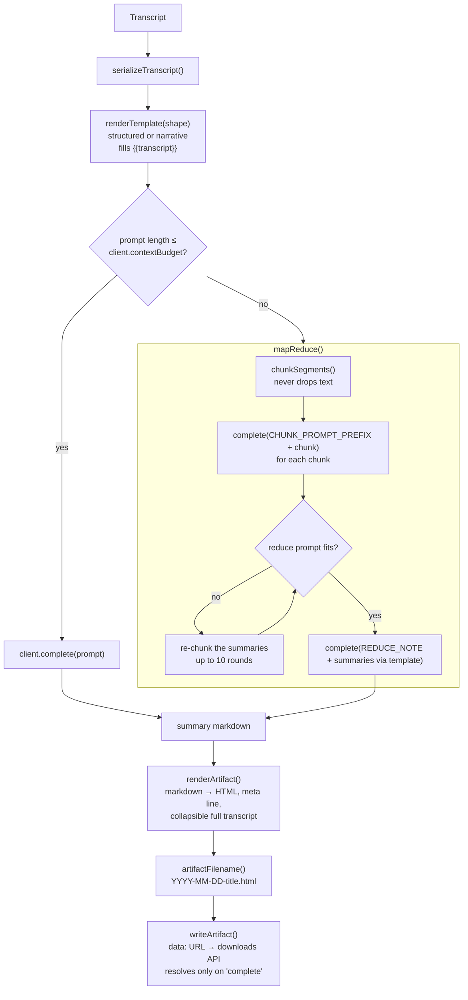

Providers (`providers/factory.ts` → `createProviderClient()`): `anthropic`, `openai`, `ollama`, `bedrock`. Each is a small `fetch` client implementing `ProviderClient { name, contextBudget, complete() }`. A missing key throws `ProviderError` before any call. Any failure becomes `PipelineError`, which sends the Transcript to the hold path.

---

## 10. Failure, hold and retry

Audio waits as a **Held Recording** if capture or transcription failed. The Transcript waits as a **Held Transcript** if summarization failed. Each is released only once the next stage is safely stored. A capture failure can leave incomplete audio; the artifact reports this limit.

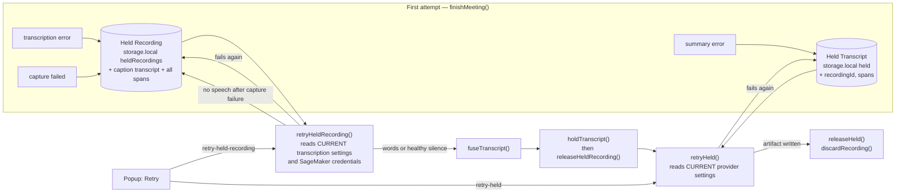

Order matters: the new Held Transcript is stored **before** the Held Recording is released, so there is no moment where the audio is gone and nothing durable replaced it. `retriesInFlight` / `recordingRetriesInFlight` stop a double-click from writing two artifacts.

**Waking after a crash or reload.** Session writes also store a versioned checkpoint in `storage.local`. The session store is authoritative, including an empty session map; the checkpoint is used only when the session store is absent or unreadable. `reconcileSessions()` runs on `onStartup` and `onInstalled`. A recovered session whose tab is gone or off the meeting URL becomes a Held Recording or Held Transcript for manual retry. It is removed from the checkpoint only after the held item is stored. A session still in a meeting whose recorder died has `recording` set to false and gets a warning. Interrupted processing returns to `capturing` with a retry warning. Recovery does not start transcription or summarization automatically.

---

## 11. Where data lives

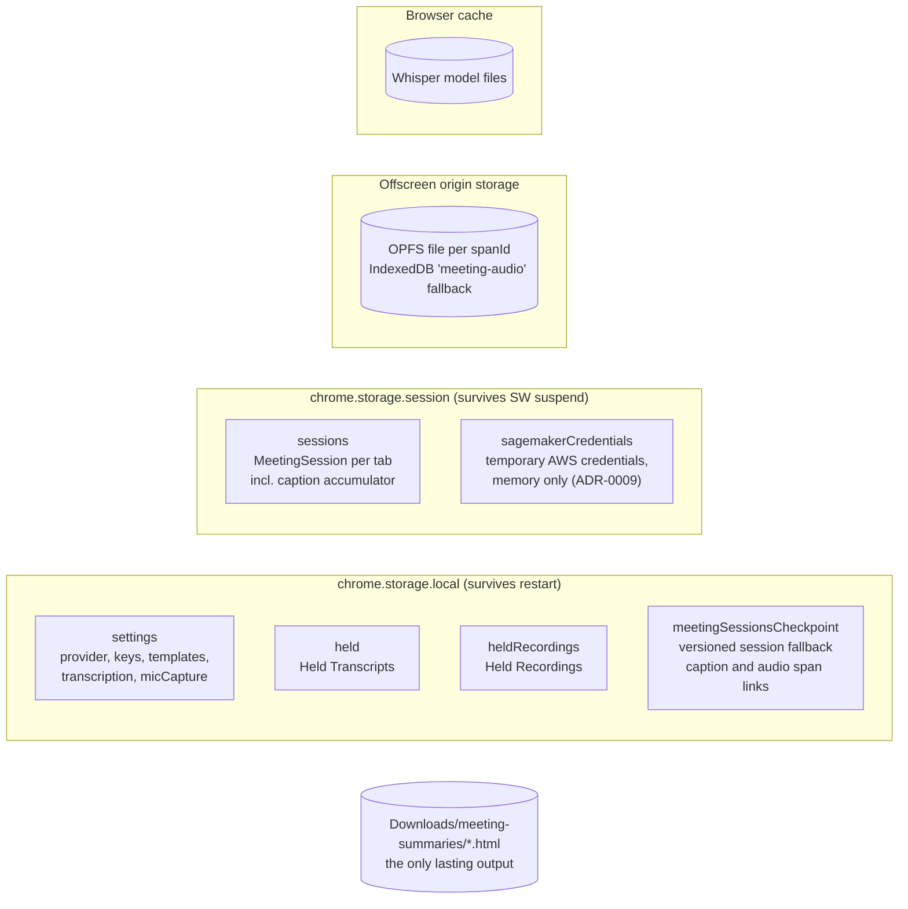

| Data | Created | Deleted |
|---|---|---|
| Caption accumulator | first `captions-update` | artifact written (reset), tab closed (`dropSession`) |
| Session checkpoint | each session write | corresponding session dropped; recovered data is held first when the meeting tab is unavailable |
| Audio span files | each Capture Start | artifact written (`offscreen-discard-spans`), unless a Held Recording still needs them |
| Held Recording | capture or transcription failed, or audio session recovered without a meeting tab | its Transcript is held |
| Held Transcript | summarization failed, or caption session recovered without a meeting tab | its artifact is written |
| Settings | Options page save | never (user-owned) |
| SageMaker AWS credentials | pasted on the Options page | cleared there, or when the browser closes (`storage.session`) |

---

## 12. Message protocol

All types are in `src/messages.ts`. Every `chrome.runtime.sendMessage` is one of these.

| Message | From → To | Handled by | Does |
|---|---|---|---|
| `captions-update` | content → SW | `handleContentMessage` | upsert Caption Snapshots into the session accumulator |
| `meeting-status` | content → SW | `handleContentMessage` | set `inMeeting`, title |
| `meeting-ended` | content → SW | `finishMeeting("auto")` | Meeting End |
| `get-capture-state` | prompt → SW | `captureStateFor` | state for the in-page card |
| `dismiss-prompt` | prompt → SW | `dismissPrompt` | hide card for this Meeting |
| `get-status` | popup → SW | `statusFor` | full `StatusReply` |
| `start-capture` | popup → SW | `startCapture` | begin a Capture Span |
| `stop-capture` | popup → SW | `stopRecording` | end the current span |
| `summarize-now` | popup → SW | `finishMeeting("manual")` | Meeting End now |
| `skip-transcription` | popup → SW | forwards `offscreen-cancel-transcribe` | use captions instead of waiting |
| `set-mic-capture` | popup → SW | `setMicCapture` | answer the mic disclosure |
| `list-held` | popup → SW | `listHeld` + `listHeldRecordings` | retry lists |
| `retry-held` | popup → SW | `retryHeld` | re-summarize a Held Transcript |
| `retry-held-recording` | popup → SW | `retryHeldRecording` | re-transcribe a Held Recording |
| `offscreen-start` | SW → offscreen | `start` | open streams, mix, record |
| `offscreen-mic-permission` | SW → offscreen | `microphonePermission` | check Chrome microphone access without opening a stream |
| `offscreen-stop` | SW → offscreen | `stop` | flush and close the span |
| `offscreen-status` | SW → offscreen | `status` | recorder health, mic, bytes |
| `offscreen-transcribe` | SW → offscreen | `transcribe` | run the Transcription Provider over all spans; carries the AWS credentials only when SageMaker is selected |
| `offscreen-cancel-transcribe` | SW → offscreen | abort + `provider.close()` | stop the WASM run |
| `offscreen-discard-spans` | SW → offscreen | `deleteSpan` per id | delete audio |
| `transcription-progress` | offscreen → SW | sets `session.transcription` | popup progress line |
| `capture-track-ended` | offscreen → SW | `finishMeeting("capture-lost")` | tab audio died |
| `mic-track-ended` | offscreen → SW | clears mic flags, sets warning | mic revoked mid-meeting |
| `capture-signal` | offscreen → SW | updates the owning session's signal state | fresh audio reached the capture graph |
| `capture-silent` | offscreen → SW | `silenceWarning` | 45 s of silence, warn while still fixable |
| `capture-failed` | offscreen → SW | records failure, stops capture, holds audio | audio clock, encoder, or storage failed |

Chrome events the service worker also listens to: `commands.onCommand` (shortcut → `startCapture`), `tabs.onUpdated` (left meeting URL → `finishMeeting("navigated")`), `tabs.onRemoved` (→ `finishMeeting("tab-closed")`, `dropSession`), `runtime.onStartup` / `onInstalled` (→ `reconcileSessions`, then restore content scripts in open meeting tabs). Restoring content scripts after an extension reload does not refresh the meeting page. `mountContentScript` stops the old runner before replacing it. The capture prompt also replaces its old card and stops polling when its extension context is no longer valid.

---

## 13. Function index

The functions to read first, by job.

| Job | Function | File |
|---|---|---|
| Content loop: observe DOM, debounce 400 ms, send diffs, detect end after the leave grace period | `startContentScript(adapter)` | `src/content/runner.ts` |
| Replace a content runner after reinjection | `mountContentScript(adapter)` | `src/content/mount.ts` |
| Teams DOM knowledge | `createTeamsAdapter()` | `src/adapters/teams.ts` |
| Zoom subtitle, footer and host-end DOM knowledge | `createZoomAdapter()` | `src/adapters/zoom.ts` |
| Caption dedupe by stable key | `TranscriptAccumulator.upsertAll()` | `src/adapters/accumulator.ts` |
| Session load / persist | `ensureSession`, `getSession`, `persistSessions`, `sessionToTranscript` | `src/background/sessions.ts` |
| Start a Capture Span | `startCapture` → `beginCaptureSpan` | `src/background/background.ts` |
| Meeting End orchestration | `finishMeeting` | `src/background/background.ts` |
| Call the offscreen transcriber | `transcribeRecording` | `src/background/background.ts` |
| Summarize and save | `summarizeAndWrite` | `src/background/background.ts` |
| Retries | `retryHeld`, `retryHeldRecording` | `src/background/background.ts` |
| Crash recovery | `reconcileSessions` | `src/background/background.ts` |
| Restore capture in open meeting tabs after extension install or reload | `restoreMeetingContentScripts` | `src/background/restore-content.ts` |
| Is this URL a meeting? | `isMeetingUrl` | `src/background/meeting-url.ts` |
| Badge text / colour | `badgeFor` | `src/background/badge.ts` |
| Popup state | `deriveCaptureState`, `isDegraded` | `src/background/capture-state.ts` |
| Mic gating | `shouldCaptureMic`, `micCaptureState` | `src/background/mic-capture.ts` |
| Chrome microphone access | `prepareMicrophoneAccess` | `src/background/microphone-access.ts` |
| Settings microphone access and unsupported-view recovery | `allowMicrophoneAccess`, `microphoneAccessFailure` | `src/options/microphone-access.ts` |
| Microphone permission check and request | `microphonePermission`, `requestMicrophonePermission` | `src/offscreen/microphone-permission.ts` |
| Silence rules (service worker side) | `refuseAudioAsSilent`, `silenceWarning` | `src/background/capture-signal.ts` |
| Record | `start`, `stop`, `watchSignal` | `src/offscreen/offscreen.ts` |
| Mix tab + mic | `mixCapture` | `src/offscreen/audio-mix.ts` |
| Check capture progress | `startCaptureHealth`, `observeCaptureHealth` | `src/offscreen/capture-health.ts` |
| Store audio | `openAudioStore`, `readSpan`, `deleteSpan` | `src/offscreen/audio-store.ts` |
| Pick engine | `createTranscriptionProviderFor` | `src/transcription/factory.ts` |
| Engine names, and which engines upload | `TRANSCRIPTION_ENGINE_NAMES`, `uploadsAudio` | `src/transcription/engines.ts` |
| Scribe words → timed, labelled spans | `spansFromScribe` | `src/transcription/elevenlabs.ts` |
| One SageMaker call, its reply, its failures | `invokeInput`, `textFromResponse`, `sageMakerFailure` | `src/transcription/sagemaker.ts` |
| The Test button's report | `testReport` | `src/transcription/sagemaker.ts` |
| Decode, window, offset, silence check | `createTranscriptionProvider().transcribe` | `src/transcription/provider.ts` |
| Skip quiet audio and restore timestamps | `nonSilentAudioRanges`, `whisperInferenceDurationMs`, `transcribeWhisperAudio` | `src/transcription/whisper-audio.ts` |
| Refuse filler output | `rejectAsSilent`, `carriesNoSpeech` | `src/transcription/silence.ts` |
| Cut windows at pauses, and find the ones with no signal | `pauseWindows`, `loudestRms` | `src/transcription/pauses.ts` |
| Names onto words | `fuseTranscript`, `speakerTrackFrom` | `src/transcription/fusion.ts` |
| Summarize | `summarizeTranscript` | `src/pipeline/pipeline.ts` |
| HTML output | `renderArtifact`, `markdownToHtml` | `src/pipeline/artifact.ts` |
| Write file | `writeArtifact` | `src/background/artifact-writer.ts` |
| LLM client | `createProviderClient` | `src/providers/factory.ts` |
| Settings with defaults | `loadSettings`, `saveSettings` | `src/settings.ts` |
| SageMaker credentials, memory only | `loadAwsCredentials`, `saveAwsCredentials`, `clearAwsCredentials` | `src/settings.ts` |
| Read pasted AWS credentials | `parseAwsCredentials` | `src/transcription/aws-credentials.ts` |
| Credentials status, popup warning | `describeCredentials`, `credentialsWarning` | `src/transcription/aws-credentials.ts` |

### Every source file

| File | Role |
|---|---|
| `src/manifest.json` | MV3 manifest: content-script matches, permissions, shortcut |
| `src/platform.ts` | `ext` = the `chrome` namespace, resolved in one place |
| `src/messages.ts` | message protocol and reply shapes |
| `src/domain/types.ts` | domain vocabulary types |
| `src/settings.ts` | defaults, load/save, upgrade merge; the SageMaker credentials in `storage.session` |
| `src/content/teams-content.ts` | Teams entry point: `mountContentScript(createTeamsAdapter())` |
| `src/content/zoom-content.ts` | Zoom entry point: `mountContentScript(createZoomAdapter())` |
| `src/content/mount.ts` | replaces the previous runner for the same platform and frame |
| `src/content/runner.ts` | shared content-script loop for any adapter: MutationObserver, 400 ms debounce, diffing, Meeting End grace period |
| `src/content/capture-prompt.ts` | in-page "start recording" card in a shadow root |
| `src/adapters/adapter.ts` | `PlatformAdapter` interface, incl. optional `leaveGraceMs` (default 10 s) |
| `src/adapters/teams.ts` | Teams caption and call-state selectors |
| `src/adapters/zoom.ts` | Zoom subtitle capture, sliding subtitle overlap, visibility, breakout grace period and host-end detection |
| `src/adapters/accumulator.ts` | dedupes Caption Snapshots into Caption Segments |
| `src/background/background.ts` | service worker: router, lifecycle, retries |
| `src/background/sessions.ts` | per-tab `MeetingSession`, stored in `storage.session` with a versioned `storage.local` checkpoint |
| `src/background/capture-state.ts` | session → `CaptureState`, degraded check |
| `src/background/capture-signal.ts` | silence/no-signal warnings and decisions |
| `src/background/capture-spans.ts` | Capture Span naming and ordering |
| `src/background/mic-capture.ts` | microphone gate and state |
| `src/background/microphone-access.ts` | check Chrome microphone access and open Settings when required |
| `src/background/badge.ts` | toolbar badge decision |
| `src/background/meeting-url.ts` | meeting-URL test: Teams hosts from the manifest, Zoom web-client `/wc/...` routes |
| `src/background/restore-content.ts` | injects the correct platform entry point and prompt into open meeting tabs on install or reload |
| `src/background/held.ts` | Held Transcript store |
| `src/background/held-recordings.ts` | Held Recording store |
| `src/background/artifact-writer.ts` | downloads API write, waits for completion |
| `src/offscreen/offscreen.html` | offscreen document shell |
| `src/offscreen/offscreen.ts` | recorder and transcription host |
| `src/offscreen/microphone-permission.ts` | check microphone permission and request it from a visible page |
| `src/offscreen/audio-mix.ts` | tab + mic Web Audio graph |
| `src/offscreen/capture-health.ts` | audio clock and encoder progress checks |
| `src/offscreen/audio-store.ts` | OPFS / IndexedDB span storage |
| `src/offscreen/signal.ts` | RMS signal and sustained-silence measure |
| `src/transcription/provider.ts` | engine-agnostic transcription core and errors |
| `src/transcription/factory.ts` | engine selection |
| `src/transcription/local-whisper.ts` | local engine: decode + worker client |
| `src/transcription/whisper-audio.ts` | quiet audio ranges, retained duration, and timestamp offsets |
| `src/transcription/whisper-worker.ts` | Web Worker running transformers.js Whisper |
| `src/transcription/whisper-protocol.ts` | worker message types, model repos, options |
| `src/transcription/openai.ts` | OpenAI transcription engine |
| `src/transcription/elevenlabs.ts` | ElevenLabs Scribe engine: diarized words → timed, labelled spans |
| `src/transcription/sagemaker.ts` | SageMaker engine: the user's Qwen3-ASR endpoint, through the AWS SDK |
| `src/transcription/engines.ts` | each engine's display name, and which engines upload audio |
| `src/transcription/pcm.ts` | 16-bit PCM encoding that both cloud engines share |
| `src/transcription/silence.ts` | degenerate-output rejection |
| `src/transcription/pauses.ts` | short windows cut at pauses, for an engine whose output has no timestamps |
| `src/transcription/aws-credentials.ts` | pasted temporary AWS credentials → key, secret, token, expiry; long-term keys refused |
| `src/transcription/fusion.ts` | Utterances + Speaker Track → Fused Transcript |
| `src/pipeline/pipeline.ts` | summarize: single-shot or map-reduce |
| `src/pipeline/chunking.ts` | budget-sized chunks, chunk/reduce prompts |
| `src/pipeline/serialize.ts` | Transcript → prompt text |
| `src/pipeline/templates.ts` | default Prompt Templates, `{{transcript}}` fill |
| `src/pipeline/artifact.ts` | Summary Artifact HTML |
| `src/pipeline/filename.ts` | artifact filename |
| `src/providers/provider.ts` | `ProviderClient` interface, `ProviderError` |
| `src/providers/factory.ts` | Provider selection |
| `src/providers/anthropic.ts` | Claude client |
| `src/providers/openai.ts` | OpenAI chat client |
| `src/providers/ollama.ts` | Ollama client |
| `src/providers/bedrock.ts` | Bedrock client (API-key bearer) |
| `src/popup/popup.html` | popup markup |
| `src/popup/popup.ts` | popup: status, actions, held lists |
| `src/options/options.html` | settings markup |
| `src/options/options.ts` | settings: providers, transcription, templates; the SageMaker credentials and its Test button |
| `src/options/microphone-access.ts` | request microphone access from a separate Settings tab and explain failures |

**Zoom web client.** The manifest loads `zoom-content.js` and `capture-prompt.js` on `zoom.us` web-client routes, including the meeting iframe. The Zoom adapter captures visible subtitles, joins overlapping sliding text, and uses the meeting footer, breakout transition and explicit host-end message to detect meeting state. Its leave grace period is 30 seconds. A native Zoom desktop meeting does not expose a browser DOM and is outside this capture path.

---

## Keeping this blueprint current

This file is part of the code. Update it **in the same commit** as any change that alters what it shows:

| You changed… | Update |
|---|---|
| Added, renamed or removed a file in `src/` | §3 module map and §13 "Every source file" |
| Added or changed a message type in `messages.ts` | §2 arrows and §12 table |
| `SessionState`, `CaptureState` or `MicCaptureState` | §5 |
| `finishMeeting`, a trigger, or the hold/silence rules | §4, §6, §10 |
| Recording, mixing or audio storage | §7, §11 |
| A transcription engine or fusion rule | §8 |
| Pipeline, templates, a Provider | §9 |
| Anything stored or deleted | §11 |
| A new platform adapter | §1, §2, §3, §4, and its platform note in §13 |

`tests/architecture-doc.test.ts` checks the mechanical part: every `src/` file path and every message `type` must appear here. It cannot check that the diagrams are still *true*. That part is on the author and the reviewer.
